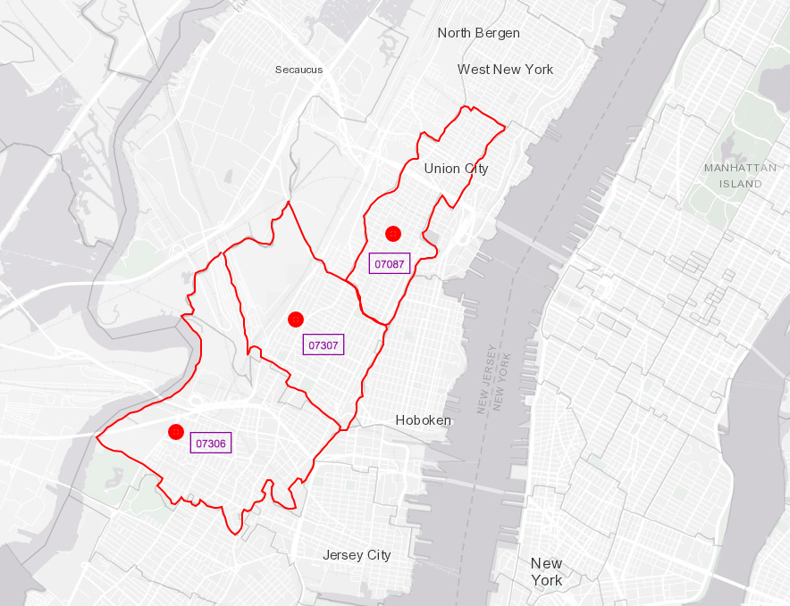
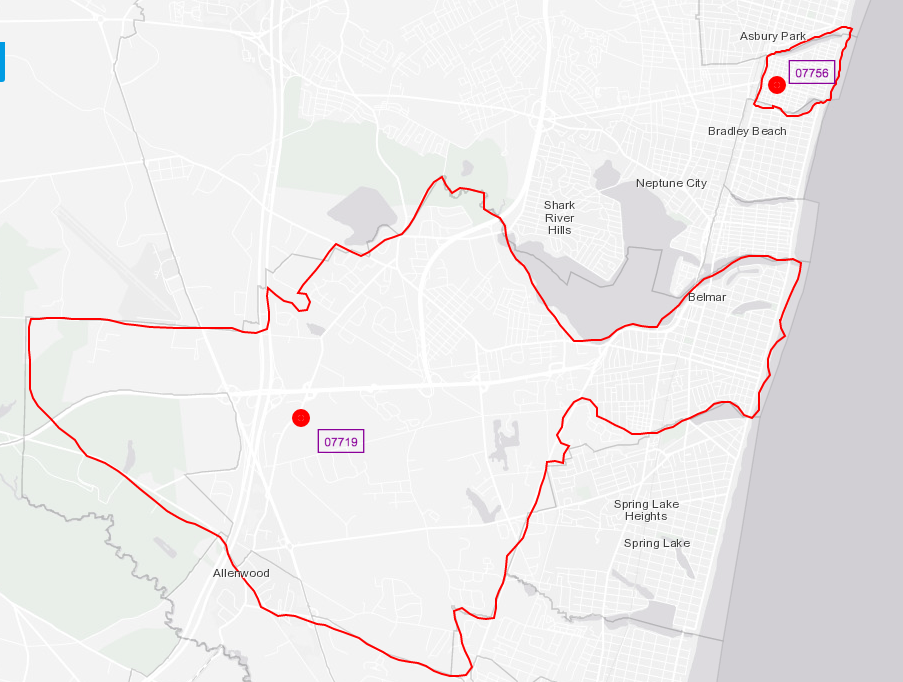
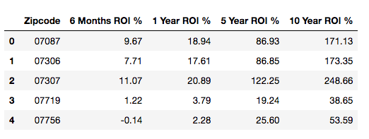

# Overview

A real-estate firm asked a simple question: What are the top 5 zipcodes in the New York Metro area for us to invest in?
___

### Guidelines:
- The real-estate firm wants to invest in areas that average a yearly value between $28,000 and $53,000.
- The real-estate wants to invest $10M into 5 zipcodes with the highest ROI possible.
- The real-estate wants to focus in the New York Metro area.
- The real-estate needs to see future ROI's of 6 months, 1 year, 5 years, and 10 years.

# Steps

1. Find all the zipcodes that are in the New York Metro area.
- 361 zipcodes
2. Find all the zipcodes in the New York Metro area that fall into the yearly average the firm is looking into.
- 179 zipcodes
3. Find the zipcodes with the highest return on investment (ROI).

4. Use ARIMA to forecast ROI for 6 months, 1 year, 5 years, and 10 years.

# Recommendations
Most of the investment money should go to the Jersey City and Union City zipcodes, which the highest return after 10 years:
Jersey City, NJ (The Heights) zip code 07307 is a city that is on the rise, investing $3,000,000 now will return $7,459,800 which is a 148.66% increase by the 10th year.
- Rental properties
Jersey City, NJ (Journal Square) zip code 07306 is another up and coming city, investing $3,000,000 now will return $5,200,500 which is a 73.35% increase by the 10th year.
- Rental properties
Union City, NJ zip code 07087 is a top city, investing $2,000,000 now will return $3,422,600 which is a 71.13% increase.
- Rental properties

Investing in Neptune, NJ and Wall, NJ will never increase the value of your investment. 

Therefore, instead invest in West New York, NJ and Ortley Beach, NJ with a percent increase of 9.86% and 1.79% respectively with the remaining $2,000,000.